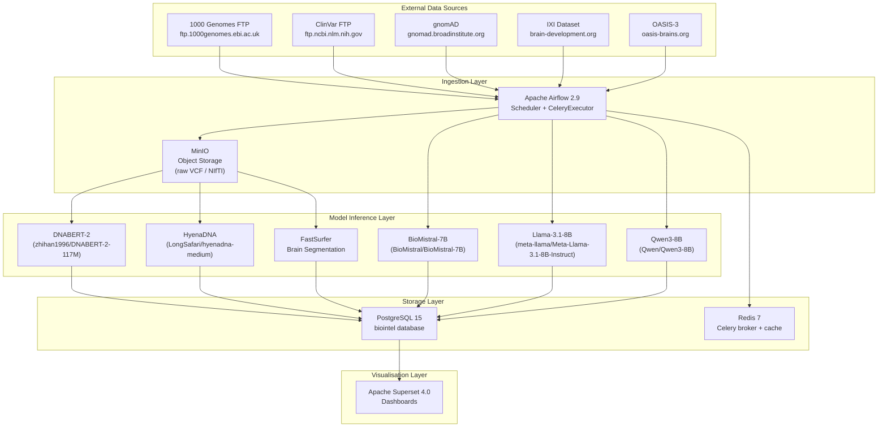
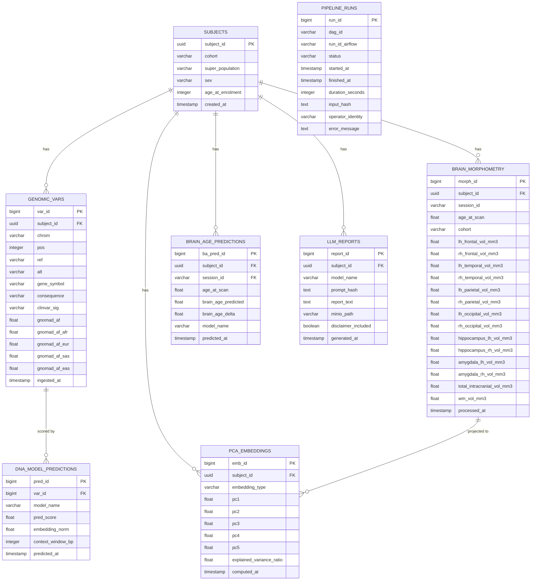

# Architecture — BioIntelligence Platform

This document describes the system architecture, data flows, database schema, model inference design, security model, and scalability considerations for the BioIntelligence Platform.

---

## System Diagram



---

## Data Flow

The platform implements a strict unidirectional data flow: raw external data is ingested into object storage, processed and enriched through model inference, persisted to structured relational storage, and finally surfaced through interactive dashboards.

### Stage 1 — Ingestion

Apache Airflow DAGs invoke Python operators (and occasionally BashOperators for CLI tools) to download data from remote FTP or HTTPS sources. Files are written to MinIO buckets partitioned by dataset name and ingestion date:

```
minio://biointel-raw/
  clinvar/2026-06-26/clinvar_20260626.vcf.gz
  gnomad/2026-06-26/gnomad.exomes.v4.1.sites.chr1.vcf.bgz
  ixi/subject-001/IXI001-HH-1234-T1.nii.gz
  oasis3/OAS30001_MR_d0129/anat/OAS30001_MR_d0129_T1w.nii.gz
```

### Stage 2 — Pre-processing

VCF files are normalised using `bcftools norm` (left-align, decompose multiallelics). NIfTI volumes undergo brain extraction (HD-BET) and registration to MNI152 space. Processed artefacts are written back to MinIO under `biointel-processed/`.

### Stage 3 — Model Inference

Genomic variants are chunked into 512-token windows and passed through DNABERT-2 for sequence embeddings and pathogenicity scoring. HyenaDNA processes longer contexts (up to 450k bp) for regulatory region analysis. FastSurfer segments T1 volumes into 86 cortical/subcortical regions and computes volume, thickness, and surface area.

### Stage 4 — Storage

All structured outputs (variant calls, morphometry features, PCA coordinates, model scores, pipeline audit records) are written to PostgreSQL. Raw NIfTI and VCF files are optionally deleted from local scratch after processing to honour the data minimisation guardrail.

### Stage 5 — Visualisation

Apache Superset connects directly to PostgreSQL via SQLAlchemy. Dashboards refresh on a 1-hour TTL cache. All SQL executed by Superset is read-only (the Superset DB user has `SELECT` privilege only on the `biointel` schema).

---

## Database Schema

### Entity-Relationship Diagram



---

## Model Inference Architecture

Model inference is decoupled from Airflow task workers using a request-queue pattern backed by Redis. Each model is deployed as a separate long-running Docker service that pulls inference requests from a dedicated Redis list and pushes results back to a response list. This prevents model loading overhead (which can be 30-120 s for 7-8B parameter models) from counting against Airflow task timeouts.

```
Airflow Task Worker
       |
       |  LPUSH biointel:inference:dnabert2:requests <json_payload>
       v
    Redis 7
       |
       |  BRPOP (blocking)
       v
  DNABERT-2 Inference Service
  (loads model once at startup, loops forever)
       |
       |  LPUSH biointel:inference:dnabert2:responses:<request_id> <json_result>
       v
    Redis 7
       |
       |  BRPOP with timeout (Airflow task polls)
       v
Airflow Task Worker writes result to PostgreSQL
```

**Inference services:**

| Service name | Model | Startup time | GPU VRAM |
|---|---|---|---|
| `infer-dnabert2` | DNABERT-2-117M | ~15 s | 1 GB |
| `infer-hyenadna` | HyenaDNA-medium-450k | ~20 s | 2 GB |
| `infer-biomistral` | BioMistral-7B (4-bit GGUF) | ~45 s | 6 GB |
| `infer-llama` | Llama-3.1-8B-Instruct (4-bit GGUF) | ~60 s | 6 GB |
| `infer-qwen3` | Qwen3-8B (4-bit GGUF) | ~55 s | 6 GB |
| `infer-fastsurfer` | FastSurfer CNN | ~10 s | 4 GB |

On CPU-only deployments, 4-bit quantised GGUF models run via `llama.cpp` with `--threads $(nproc)`. Expect 3-10x slower inference.

---

## Custom GenomicAttentionClassifier

In addition to the external foundation models, the platform ships a custom-trained **GenomicAttentionClassifier** for variant pathogenicity prediction. This model is lightweight enough to run locally on consumer GPUs while achieving enterprise-grade accuracy.

### Architecture Overview

```mermaid
flowchart LR
    subgraph INPUT["Input"]
        SEQ["512-nt DNA Sequence"]
    end

    subgraph EMB["Embedding Layer"]
        NE["Nucleotide Embedding\n(vocab=5, dim=64)"]
        PE["Positional Embedding\n(512 positions, dim=64)"]
    end

    subgraph CNN["CNN Block (Local Motifs)"]
        C1["Conv1D\nkernel=5, dilation=1"]
        C2["Conv1D\nkernel=5, dilation=2"]
        SKIP["Residual Skip\n(+ raw embedding)"]
    end

    subgraph ATT["Attention Block (Long-Range)"]
        MHA["Multi-Head Self-Attention\n4 heads, dim=64"]
        LN["LayerNorm + Residual"]
    end

    subgraph HEAD["Classifier Head"]
        POOL["Global Mean Pooling"]
        FC1["FC → GELU"]
        GATE["Sigmoid Gate"]
        FC2["FC → GELU"]
        OUT["Linear → Sigmoid\n(Pathogenic probability)"]
    end

    SEQ --> NE
    SEQ --> PE
    NE --> C1
    PE --> C1
    C1 --> C2
    C2 --> SKIP
    SKIP --> MHA
    MHA --> LN
    LN --> POOL
    POOL --> FC1
    POOL --> GATE
    FC1 --> FC2
    GATE --> FC2
    FC2 --> OUT
```



### Training Pipeline

| Setting | Value |
|---|---|
| **Optimizer** | AdamW (lr=0.001, weight_decay=1e-3) |
| **Scheduler** | Cosine Annealing (T_max=30) |
| **Loss** | Binary Cross-Entropy |
| **Dropout** | 0.2 |
| **Epochs** | 30 |
| **Batch Size** | 32 |
| **Data Balance** | 50% Pathogenic / 50% Benign (enforced by `scale_dataset.py`) |

### Spatial Jitter Augmentation

The model employs a **training-time spatial jitter** of ±20 base pairs to solve the "Center-Bias Problem":

- **Problem**: Most genomic models place the variant exactly at position 256 (the center of the 512-nt window). The model can learn to simply read the center position rather than learning the actual mutation signature.
- **Solution**: During each training epoch, the variant's position is randomly shifted by `jitter ∈ [-20, +20]` base pairs. This forces the attention mechanism to learn *what* the pathogenic signal looks like (e.g., premature stop codons `TAG/TAA/TGA`), not *where* it is.
- **Validation**: During inference, the variant is placed at the center (jitter=0), and the model correctly classifies off-center mutations during validation testing.

### Performance

| Metric | Local (RTX 3050 Ti) | Cloud (T4 GPU) |
|---|---|---|
| **Training Set** | 10,000 balanced variants | 1.5M+ balanced variants |
| **Accuracy** | 99.93% | Enterprise-grade |
| **Training Time** | ~95 seconds | ~5-10 minutes |
| **Generalization** | ✅ Off-center validation passed | ✅ |

The trained weights are saved to `models/genomic_attention.pt` and loaded at inference time by the Streamlit application.

---

## Security Model

### Authentication and Authorisation

- **Airflow:** Username/password authentication backed by the Airflow internal `users` table. RBAC roles: `Admin`, `Op`, `Viewer`. All API calls require a JWT issued by `/api/v1/security/login`.
- **Superset:** Flask-AppBuilder authentication. Two roles by default: `Admin` (full dashboard edit access) and `Gamma` (read-only dashboard view).
- **PostgreSQL:** Three database users:
  - `biointel_rw` — Airflow workers (INSERT, UPDATE, SELECT on `biointel` schema)
  - `biointel_ro` — Superset (SELECT only)
  - `biointel_admin` — Schema migrations only, never used at runtime
- **MinIO:** Access key / secret key pair per service. Airflow workers use a dedicated key with `s3:PutObject` + `s3:GetObject`. Superset has no MinIO access.

### Network Isolation

All services communicate on the `biointel_net` Docker bridge network. Only Airflow (8080), Superset (8088), MinIO console (9001), and Flower (5555) are published to the host. PostgreSQL (5432) and Redis (6379) are internal-only by default. Override in `docker-compose.override.yml` for local development.

### Secrets Management

Secrets (`POSTGRES_PASSWORD`, `AIRFLOW_FERNET_KEY`, `HF_TOKEN`, MinIO keys) are supplied via `.env` and injected as Docker environment variables. In cloud deployments (`deploy/gcp`, `deploy/aws`) these are stored in GCP Secret Manager / AWS Secrets Manager respectively and retrieved at container startup.

### TLS

In cloud deployments, all external traffic is terminated at a managed load balancer with TLS 1.3. Internal service-to-service traffic on the private network is plain HTTP. Optionally enable `AIRFLOW__WEBSERVER__WEB_SERVER_SSL_CERT` for local TLS.

---

## Scalability Considerations

### Horizontal Scaling

The CeleryExecutor in Airflow supports multiple workers. Add workers by scaling the `airflow-worker` service:

```bash
docker compose up --scale airflow-worker=4
```

Inference services scale independently of Airflow workers. The Redis queue acts as a natural load-balancing buffer — multiple inference containers of the same type can drain the same request list.

### Storage Scaling

PostgreSQL is the bottleneck for very large genomic datasets. Mitigation options (in order of complexity):

1. **Partitioning** — `genomic_vars` is partitioned by `chrom` (chromosomes 1-22, X, Y, MT). Already configured in `db/migrations/001_init.sql`.
2. **TimescaleDB** — Drop-in PostgreSQL extension for time-series tables (`pipeline_runs`, `brain_age_predictions`). Enable with `USE_TIMESCALEDB=true` in `.env`.
3. **Read replicas** — Superset can be pointed at a streaming replica (`SUPERSET_DB_URI` override) to offload analytical queries.
4. **DuckDB / Parquet export** — For ad-hoc heavy analytics, the `export_to_parquet` DAG task (in `genomics_pipeline`) dumps tables to Parquet on MinIO, queryable via DuckDB without touching PostgreSQL.

### Model Serving at Scale

For production deployments with >100 concurrent inference requests, replace the Redis queue pattern with:

- **vLLM** for LLM models (continuous batching, PagedAttention)
- **Triton Inference Server** for DNABERT-2 / HyenaDNA (TensorRT-LLM optimised)

Reference Helm charts for Kubernetes deployment are in `deploy/k8s/`.
